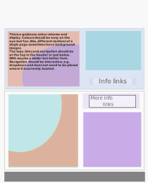

# ESACH - (esach.org.eu) 

‘’’European Students association for Cultural Heritage ‘’’

It is an inter-university cross-border network whose main objective is the interdisciplinary collaboration among European University Students, alumni and also young professionals in the field of Cultural Heritage. 

## About  
It is a youth-led network that includes undergraduates and graduate university students, PhD candidates, early career researchers and young professionals with an interest in cultural heritage studies. 

## Goal 
The aim of ESACH is to establish an interdisciplinary network of university students, from undergraduates to postgraduate levels, young researchers and early-career professionals working in cultural heritage within Europe. The development of this network will increase youth participation in heritage practice, contribute towards a more cohesive heritage practice in Europe and provide members with valuable inter-disciplinary knowledge which will prepare them for work in the challenging field of cultural heritage study, conservation and protection.

# ESACH Network - 

## ESACH Genoa
Is  a group of students from different branches of art history and cultural heritage conservation that focus their studies of heritage and conservation that focus their studies on heritage and social action from a critical point of view and seeking to care for the areas degrades of its city and declared its as World Heritage Site.

## ESACH Lisbon 
Activities focus on the dissemination of knowledge about cultural heritage to the citizens of  Lisbon, through the master’s degree program, conferences, workshops and collaborations with Lisbon associations such s ICOMOS Lisbon. Contact Coordinator (Alexndra De Carvalho Antunes)

## ESACH Girona 
Group of students and young professionals from Catalonia who study cultural heritage together with the perspective of natural heritage. It has students from the Universities of Girona, as well as students from the University of the Balearic Islands, through the e-MTA Campus. The Members of ESACH GIRONA are from Master in Heritage mainly specialties  in Cultural Heritage and Natural Heritage.

## ESACH Madrid
Currently all members are from MA Cultural Heritage in the XX1 Century: Management & Research, attached to the Department of Prehistory, Ancient History and Archaeology of the Faculty of Geography and History of the Complutense University of Madrid and to the Technical University of Madrid.

## ESACH Mantua 
Goal is to develop our knowledge about heritage while learning more about the cultural treasures in the region of Lombardy – Veneto. These activities include workshops, architecture tours and day trips, trips to events such as the Venice Biennale, talks by local architects working in the field of heritage conservation and students Conferences.

## ESACH Opole 
It is made up of a group of Law students (BA, MA and PhD) from the UNESCO Chair on Cultural Property Law of the University of Opole that seeks to investigate and raise awareness among society and all students of the need to protect cultural heritage from Poland and Europe. 

# Past events - 

Since 2017 we have done many activities. We continue! 

2020 – No events this year
-----------------------------------------------------------------------------------------------------------------
2019
1. ESACH OPOLE – ESACH at the Science Festival “Science Spring” of Opole University
2. ESACH Madrid – Conference on Cultural Heritage in Europe
3. ESACH Passau – (11.7.2019) – My culture + your culture = world culture ?!
4. ESACH Genoa | Second ESACH Meeting – Event ESACH Meeting Genoa 2019
-----------------------------------------------------------------------------------------------------------------
2018
1. ESACH Girona – ESACH Meeting 2018: 7-9 June 2018 in Girona, Spain
2. Student Summit: 22-24 June 2018 in Berlin, Germany
3. ESACH Madrid – ESACH Message at the Conferences about Intangible Cultural Heritage organized by FACYDE

## Coordination Committee - 
1. Marius Muller (Founding President)
2. Carlota Marijuan Rodriguez (Vice President, External Communications & Partners)
3. Nuria Gscons Cuatrecasas (Internal Communications & Member Engagement)
4. Ainara Guerra Fernandez (Digital Media Manager)
5. Alexandra de Carvalho Antunes (Publications)

# Supporting Institutions & Partners 

Write us an email to the External Communication & Partners representative

## Universities that have organized an ESACH Meeting  
1. Universitat de Girona is a Catalan institution founded in 1446, reconstituted in 1991 (www.udg.edu)
2. University of Genova is an Italian institution founded in 1481. (www.unige.it)
3. The Complutense University of Madrid is a Spanish Institution founded in 1499 (www.ucm.es)

## Partners  
Europa Nostra – It is the leading pan-European Federation of NGOs active for more than 50 yrs in over 40 countries. It is recognized as the most representative heritage network in Europe and the voice of civil society committed to safeguarding and promoting Europa's cultural heritage. It contributes to the development of heritage-related policies and strategies in Europe, celebrates excellence and promotes best practices through the European Heritage Awards / Europa Nostra Awards. 

## Supporting Institutions - 
The German National Committee of ICOMOS is a international non-governmental heritage organization. 
The German Cultural Heritage Committee, the most important German organizations in the field of monument protection and conservation are assembled. 
The Santander Art and Culture Law Review is a bi-annual journal.
Mazu Press is a publishing company newly established in Portugal. 
Euro

# FAQ - 

## What is ESACH ?
It is an inter-University cross-border network whose main objective is to collaborate among the European university students in the field of Cultural Heritage. 
ESACH was born in 2017 at the University of Passau motivated by the celebration of the European Year of Cultural Heritage 2018 with the aim of becoming a meeting and exchange place for new generations of heritage field. A place to take the first steps between studies and the professional world, where you can meet people with your same interests and start getting involved with civil and professional associations, governments and other public and private agents of the European Cultural Heritage. 

## Who is Behind ESACH?
With the support of the participant universities, ESACH moves thank to the students and young professionals that are part of each group. The people who are a part of this coordination committee is the main organism that rules the network and works together with the groups to provide the proper cover to their activities. They manage the representation, PR, internal communication, publications, international meeting, financial issues and coordination between all the members in a European Level.

## What About the Language?
The official language of our European network continuous being English. 

# Contact Information - 

Send Us an Email – studentsforculturalheritage@gmail.com

Ask a Question – Name*, Email*, Message*

Social Networks - 
[facebook](https://www.facebook.com/ESACHspirit/)
[Twitter](https://twitter.com/esach_spirit)
[Youtube](https://www.youtube.com/channel/UCi-Xq75ID4NbkwLqBb-lAGA)

Privacy policies – Important note concerning data processing in connection with Google Analytics.

[Google Privacy Policy](https://policies.google.com/privacy)
[Google Ads Settings](https://adssettings.google.com/authenticated)

For ESACH Newsletter – Enter your email address to subscribe

# Working Files - 

You can use the above description as per your requirement in the pages listed below. You can use images and sample designs provided in the folder. You can use Open Sans or Lato as a font. What we need is high readability and friendly experience. 

The layout implies spreading up content upon a full screen photo/image. Thus, text sections or menu sections are there to support the "living" image. We want to immediately anchor the subject of a site in the mind of a visitor. 

### Web pages
1. Home (file_name – index.html,  Title – Home)
2. About (Title - About us)
3. FAQ (Title - FAQ)
4. Contact (Title - Contact Us)
5. Network (Title - Network)
6. Supporting Institutes (Title - Supporting Institutions & Partners)
7. Committee (Tittle - Committee Coordinators)
8. News (Title - News)
9. Events (Title - Events)
10. Publications (Title - Publications)
11. Donate (Title - Donate now)
12. Get Involved (Title - Want to Join)

### Website Design Diagram

### Example Colour scheme

### SVG Designed Logo 

### Links for Videos - 
[Video link 1]( https://youtu.be/kotDM3YnzdU)

[Video link 2]( https://youtu.be/JHnQK1Dhww0)

### XML example Document
An [XML document]( event_calander.xml ) has been created for the events calendar page. 

